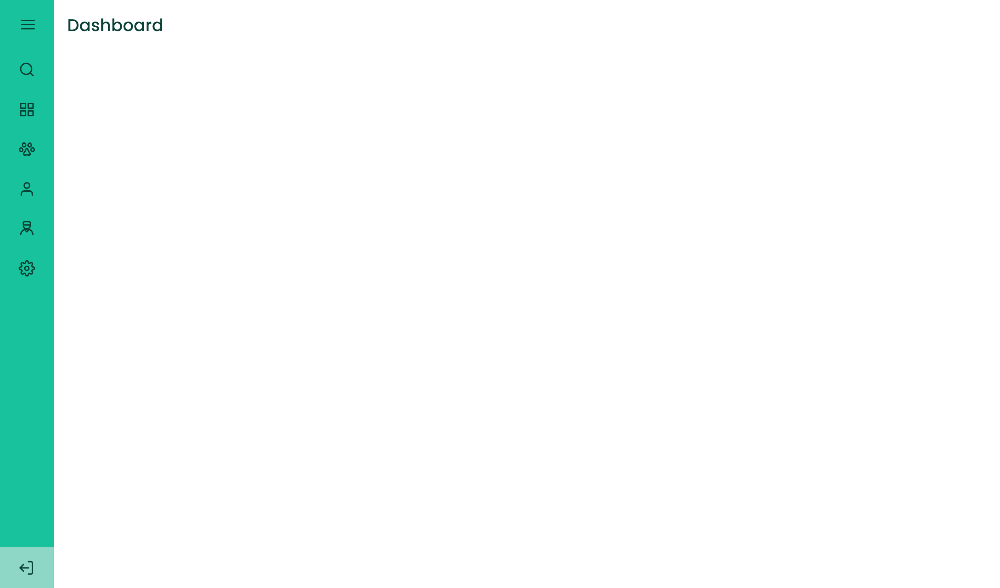

# Sidebar Responsiva

  Preview:
    &nbsp;&nbsp;&nbsp;
  <a href="./preview/Aberto">
    Aberto
  </a>
    &nbsp;&nbsp;&nbsp;|&nbsp;&nbsp;&nbsp;
  <a href="./preview/Fechado">
    Fechado
  </a>

## Projeto 💻
Projeto de um desafio da Rocketseat de criar uma sidebar responsiva.

## Layout 🔖
Segue abaixo o layout deste projeto:
- [Figma](https://www.figma.com/file/3bFjNGDYGrlkQGliietsMo/DD-%2F-Sidebar-Responsiva-(Copy)?t=EZm9cuVLqu4ao6vt-6)

## Instalação 🛠
Siga esses passos para instalar o repositório na sua máquina:
1. Rode `git clone https://github.com/miishiyama/Sidebar-Responsiva` para fazer um clone desse repositório.

## Tecnologias 🚀
As tecnologias utilizadas neste projeto são:
- HTML
- CSS
- JavaScript
- DOM
- Google Fonts

## Créditos ❤️
Feito por [Millene Eduarda Ishiyama](https://github.com/miishiyama/).
